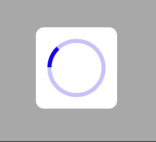

# NDLoading
Loading for iOS





## Requirements

- Runs on iOS 10.0 and later
- Requires Swift 5.0  and ARC.

## Installation

NDLoading is available on CocoaPods.

CocoaPods:

```ruby
pod "NDLoading"
```
## USAGE


```swift
NDLoading.show()
NDLoading.dissmiss()
```

If you want to use the custom option, you can do:

```swift
//Set style for Loading
NDLoading.style = .Style7

//Custom props for Loading
let setting = NDLoadingSetting()
setting.mainColor = UIColor.blue
setting.widthLoading = 4.0
NDLoading.setting = setting
...
    
```

